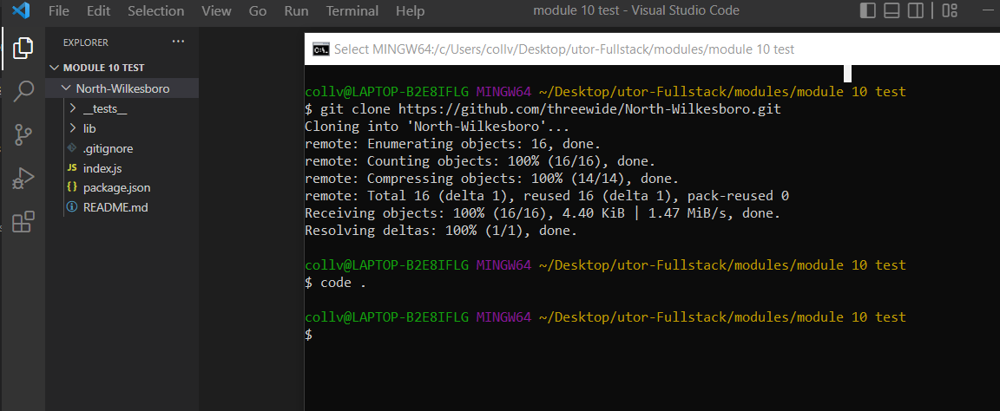

# <10-Module>

## Description

Generates an HTML webpage based on input about employees on a software engineering team. This program will help quickly organize a software engineering team with brief details of the different employees and contact info.

## Table of Contents

- [Installation](#installation)
- [Usage](#usage)
- [Credits](#credits)
- [License](#license)

## Installation
To Install and begin working on the Team Profile Generator follow these easy steps:

1. Copy the repository link [Team Profile Generator Repository](https://github.com/threewide/North-Wilkesboro.git)
2. Open the terminal to the directory you would like the repo saved in
3. In the terminal enter 'git clone https://github.com/threewide/North-Wilkesboro.git' to create a clone of the Team Profile Generator Repository
4. In the terminal enter 'code .' to open the project in Visual Studios development environment



## Usage

Provide instructions and examples for use. Include screenshots as needed.

To add a screenshot, create an `assets/images` folder in your repository and upload your screenshot to it. Then, using the relative filepath, add it to your README using the following syntax:

    ```md
    
    ```

## Credits

Rich Widtmann [Professional README Guide](https://coding-boot-camp.github.io/full-stack/github/professional-readme-guide)
Course Gitlab [Instructor Demo: Git](https://utoronto.bootcampcontent.com/utoronto-bootcamp/UTOR-VIRT-FSF-FT-05-2022-U-LOLC/-/tree/main/01-HTML-Git-CSS/01-Activities/03-Ins_Git)
Choose a License [MIT License Template](https://choosealicense.com/licenses/mit/)

## License

Copyright (c) [2022] [Justin Collver]

Permission is hereby granted, free of charge, to any person obtaining a copy
of this software and associated documentation files (the "Software"), to deal
in the Software without restriction, including without limitation the rights
to use, copy, modify, merge, publish, distribute, sublicense, and/or sell
copies of the Software, and to permit persons to whom the Software is
furnished to do so, subject to the following conditions:

The above copyright notice and this permission notice shall be included in all
copies or substantial portions of the Software.

THE SOFTWARE IS PROVIDED "AS IS", WITHOUT WARRANTY OF ANY KIND, EXPRESS OR
IMPLIED, INCLUDING BUT NOT LIMITED TO THE WARRANTIES OF MERCHANTABILITY,
FITNESS FOR A PARTICULAR PURPOSE AND NONINFRINGEMENT. IN NO EVENT SHALL THE
AUTHORS OR COPYRIGHT HOLDERS BE LIABLE FOR ANY CLAIM, DAMAGES OR OTHER
LIABILITY, WHETHER IN AN ACTION OF CONTRACT, TORT OR OTHERWISE, ARISING FROM,
OUT OF OR IN CONNECTION WITH THE SOFTWARE OR THE USE OR OTHER DEALINGS IN THE
SOFTWARE.

## Features

If your project has a lot of features, list them here.

## Tests

Go the extra mile and write tests for your application. Then provide examples on how to run them here.